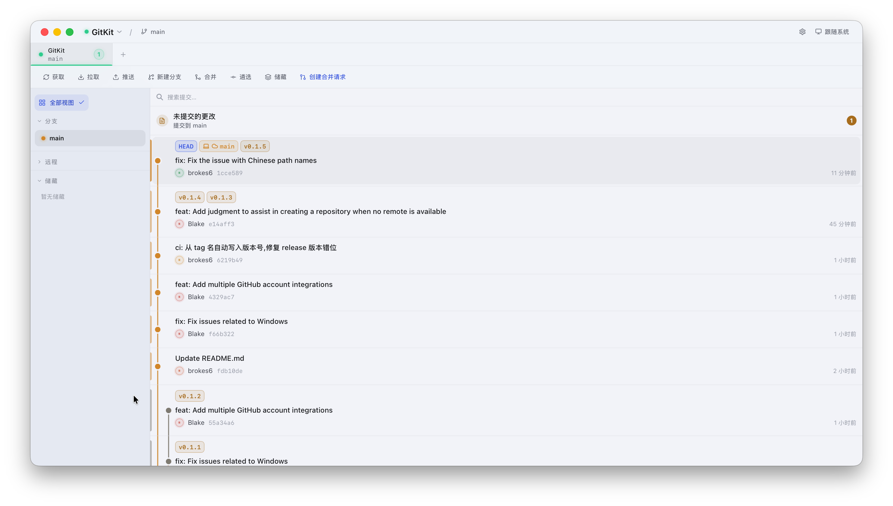
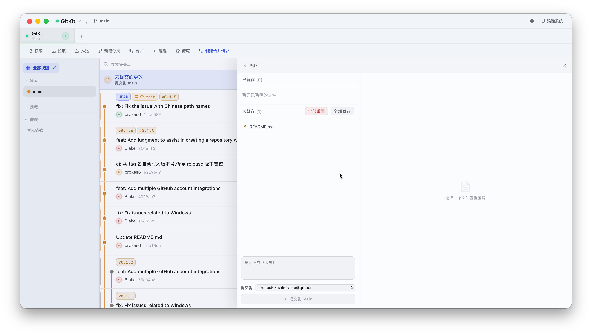
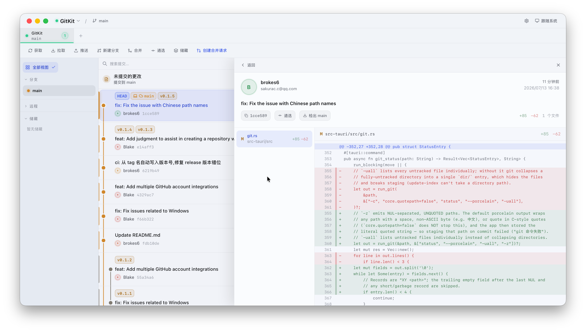
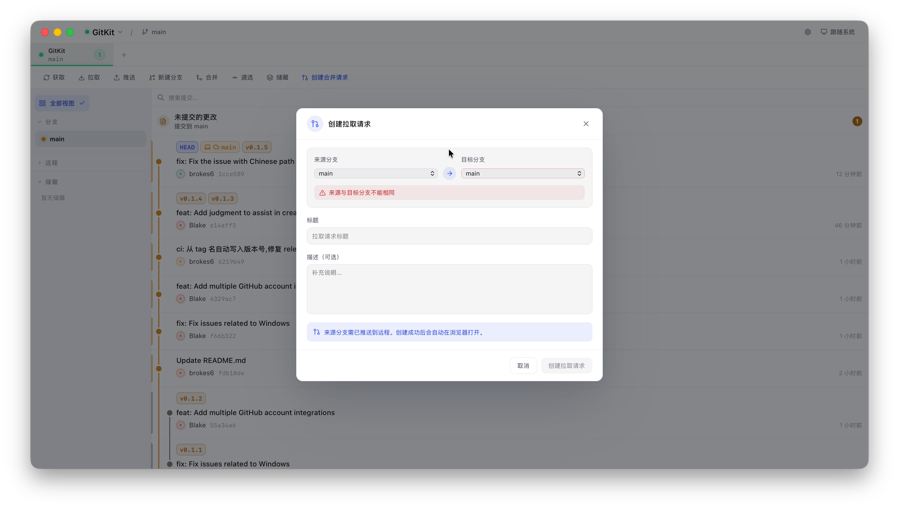
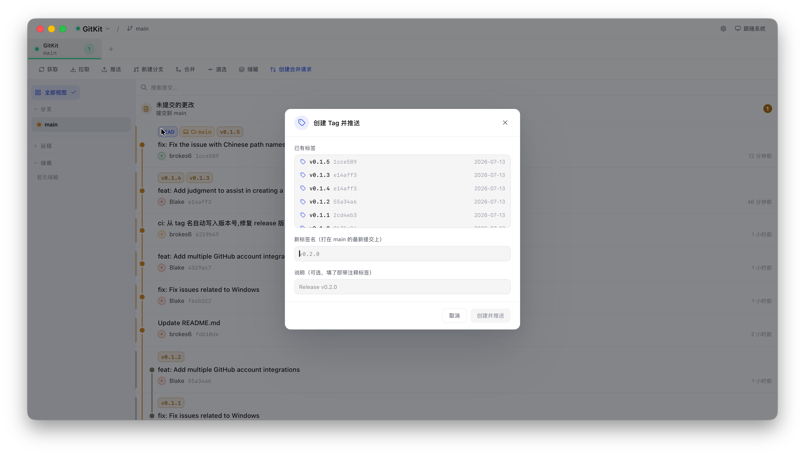

# GitKit

一个原生桌面 Git 客户端 —— **Tauri (Rust) + React + TypeScript + Tailwind CSS v4**。

主要面向 macOS 打磨（原生窗口、红黄绿灯、毛玻璃），同时支持 Windows。后端直接调用系统 `git`，自动复用你已配置的 SSH key / 凭证 / hooks，认证零配置，行为与命令行完全一致。

> 状态:功能完整，可日常使用。持续打磨中。



---

## 核心特性

**可视化历史**
- 真实分支 / 提交历史 / 提交详情(文件列表 + diff)
- 提交图(拓扑泳道):按分支上色、与侧栏分支圆点同色、合并来源着色、分支名标签
- hover 分支联动高亮、单击聚焦只看一条、隐藏分支同时从图中移除

**分支管理**
- 分支树:`prefix/*` 文件夹分组、置顶、隐藏(单条 / 整组)、当前分支高亮
- 双击切换分支(确认弹窗,可先储藏再切换)
- 本地 + 远程分支、ahead/behind、upstream 追踪

**写操作**(全部走系统 git 认证)
- Fetch / Pull / Push / Merge(带冲突预览)/ Cherry-pick
- 暂存 → 提交(注入选定的提交者身份)、创建分支、丢弃改动(单文件 / 全部)
- Tag:创建、推送
- 储藏:创建、列表、apply、drop、查看储藏内文件与 diff

**账号与协作**
- 多套提交者身份(默认身份 + 项目级覆盖,提交时注入)
- 多 GitHub 账号集成
- 一键创建 PR / MR(GitLab + GitHub REST,可检测连接)
- 无远程时协助创建远程仓库 + `remote add`

**原生体验**
- macOS 毛玻璃 vibrancy(运行时可开关)、窗口位置/尺寸记忆
- 6 套主题配色(暖陶土 / 晴空蓝 / 森野绿 / 暮光紫 / 玫瑰 / 石墨)× 亮 / 暗 / 跟随系统
- 系统字体、长列表滚动优化
- 自动更新(签名校验、带下载进度)、依赖检测(检查 git / git-lfs)

---

## 界面预览

| 更改与提交 | 提交详情与 diff |
|---|---|
|  |  |

| 设置 · 主题与外观 | 创建 PR / MR |
|---|---|
|  |  |

| 新建分支 | 创建 Tag 并推送 |
|---|---|
|  |  |

---

## 环境要求

- **macOS**:Xcode 命令行工具 · **Windows**:MSVC 构建工具 + WebView2
- Node ≥ 18
- Rust(rustup)

## 开发运行

```bash
cd GitKit
npm install
npm run tauri dev        # 首次会编译 Rust,约几分钟;之后秒开
```

> 若 `npm install` 中途失败残留坏 `node_modules`,重装前先 `rm -rf node_modules package-lock.json`。
> 改前端(`src/**`)热更新;改 Rust(`src-tauri/**`)需重启 `tauri dev` 重编。

## 打包

```bash
# macOS 通用二进制(Apple Silicon + Intel),编译目标只需加一次
rustup target add aarch64-apple-darwin x86_64-apple-darwin
npm run tauri build
```

产物在 `src-tauri/target/release/bundle/`。CI(`.github/workflows/release.yml`)在打 tag 时自动构建 macOS 通用二进制与 Windows 安装包并发布 Release。签名、公证、更新分发流程见 [`RELEASE.md`](RELEASE.md)。

---

## 技术栈

- **外壳**:Tauri v2(Rust)—— 原生窗口、`titleBarStyle: Overlay` 红黄绿灯、原生文件夹选择器
- **前端**:React 18 + TypeScript + Vite + Tailwind CSS v4,单文件 UI(`src/App.tsx`)
- **Git 后端**:Rust `shell out` 调用系统 `git`(非 libgit2),复用用户 SSH / 凭证 / hooks
- **主题**:Claude 暖色系(奶油底 + 陶土 coral 强调),亮 / 暗两套

## 目录结构

```
GitKit/
├── index.html, vite.config.ts, tsconfig*.json
├── HANDOFF.md              # 完整架构 / 数据流 / 加功能手册(接手必读)
├── RELEASE.md              # 发布 / 签名 / 公证 / 更新手册
├── src/
│   ├── main.tsx            # React 入口
│   ├── App.tsx             # 全部 UI + 状态(单文件)
│   ├── git.ts              # 前端 Git API:invoke 封装 + 图形算法 + 类型映射
│   └── styles/             # Tailwind v4 + 主题 CSS 变量
└── src-tauri/
    ├── Cargo.toml, tauri.conf.json
    ├── capabilities/       # 前端可调用的权限白名单
    ├── icons/
    └── src/
        ├── main.rs, lib.rs # 入口 + 插件注册 + invoke_handler
        └── git.rs          # 所有 Git 命令实现
```

## 架构要点

- **认证零配置**:后端直接 shell 调系统 `git`,自动复用用户的 SSH key / 凭证管理 / hooks。
- **不冻结 UI**:所有 git 命令是 `async fn` + `run_blocking`,把阻塞的 shell 调用挪到线程池(Tauri 同步命令跑在主线程,会卡 UI)。
- **分支归属**:`attributeBranches` 从每个分支尖端沿 first-parent 回溯,给提交打 `branchLabel`;`computeGraph` 据此算泳道并上色,侧栏与图共用 `branchColor(name)`。
- **PATH 补全 + LFS 兼容**:GUI 应用继承精简 PATH,`augmented_path()` 补上 Homebrew/MacPorts;分支切换类命令走 `run_git_nohooks` 规避 git-lfs 钩子误判失败。

> 想加功能或深入理解数据流,读 [`HANDOFF.md`](HANDOFF.md) —— 有完整的后端命令表、前端 API、组件清单、"加一个 Git 命令的标准套路"和已知坑。

## 路线图

- [x] 脚手架 + 原生窗口 / 红黄绿灯 / 系统字体 / App 图标
- [x] 读:分支 / 历史 / 提交图 / 提交详情 / 工作区状态 / diff
- [x] 分支树:分组 / 置顶 / 隐藏 / 高亮 / 双击切换
- [x] 写:Fetch / Pull / Push / Merge / Cherry-pick / 暂存提交 / 分支 / Tag / 储藏 / 丢弃
- [x] 多提交者身份 + 多 GitHub 账号 + 创建 PR/MR + 建仓
- [x] 原生打磨:vibrancy 毛玻璃 / 窗口记忆 / 自动更新 / 签名配置
- [x] 跨平台:Windows 支持 + 中文路径修复 + CI 自动发布
- [ ] Token 从 localStorage 迁移到系统钥匙串(`keyring` / `stronghold`)
- [ ] 右键菜单继续扩充、提交搜索增强

## 已知限制

- **vibrancy 用私有 API**:开了 `macOSPrivateApi` + 透明窗口,无法上架 Mac App Store,只能 Developer ID 外分发(设置里可运行时关闭毛玻璃)。
- **Token 明文存储**:平台 Token 目前存 localStorage 明文,建议后续迁移到系统钥匙串。
- **自动更新私钥不可丢**:`src-tauri/.tauri/gitkit-updater.key` 已 gitignore,丢失将无法再签更新,务必离线备份(见 `RELEASE.md`)。
